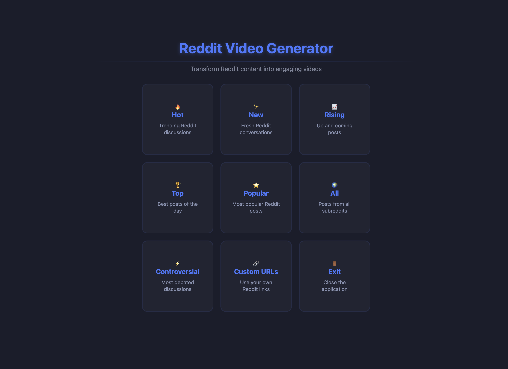
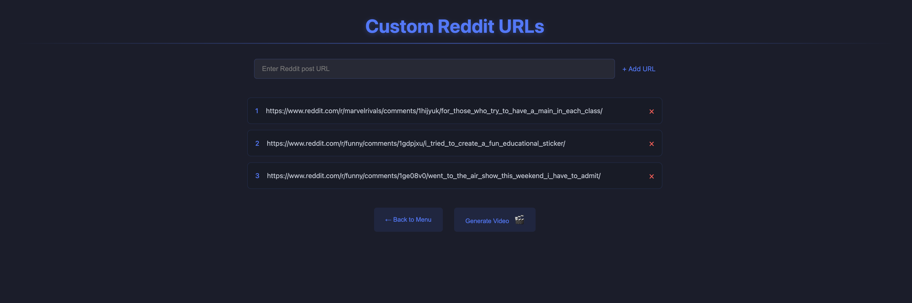
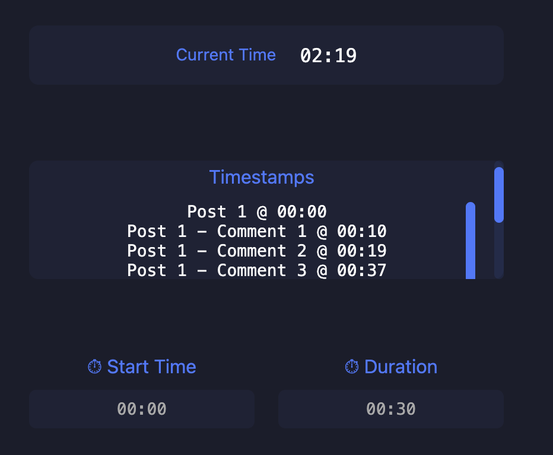
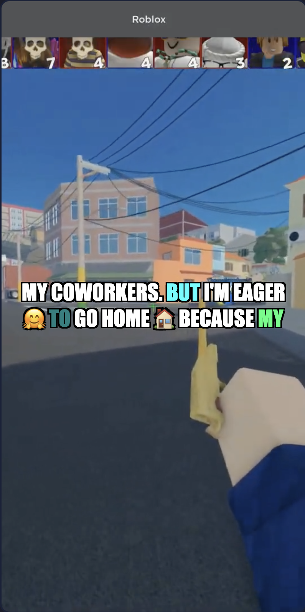
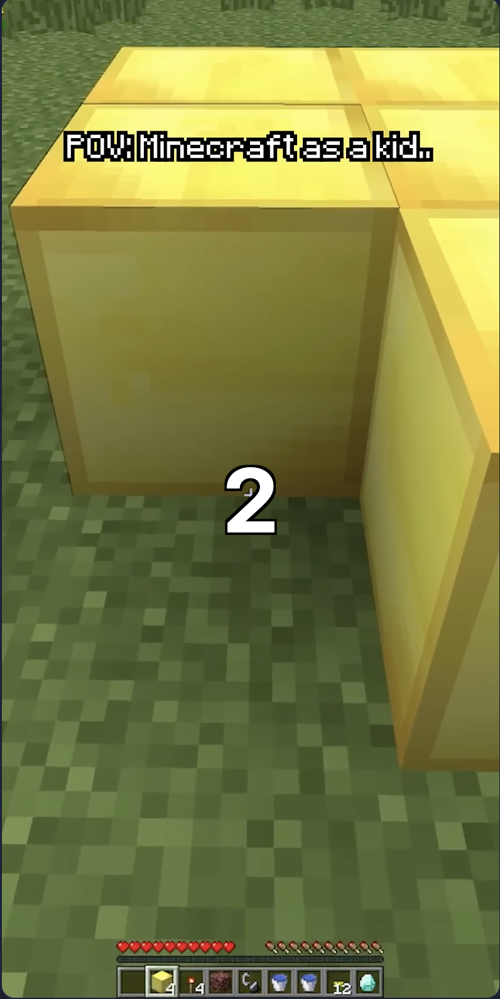
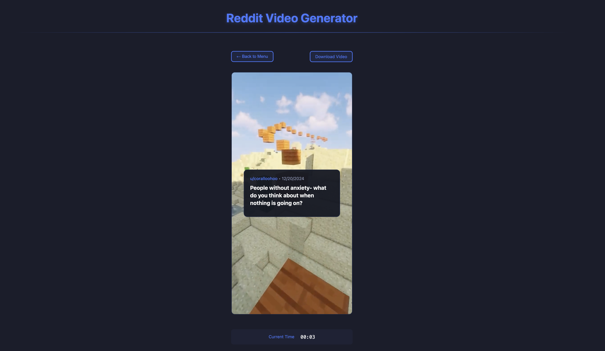

# Reddit Video Generator

**A Node.js-based web application that transforms Reddit posts into an interactive, narrated video feed—complete with changing backgrounds, subtitles, voice-over from AWS Polly, and the ability to handle both standard Reddit categories and custom URLs.**

## Overview

The Reddit Video Generator fetches posts and comments from Reddit using the Snoowrap API wrapper. It then uses AWS Polly to synthesize voice-overs for the posts and comments, creating a lively, narrated experience. The UI leverages Socket.io for real-time updates, ensuring a smooth, interactive flow as posts and comments appear on screen. Background videos are sourced from AWS S3, providing dynamic visuals behind the text and commentary.

**Key Features:**
- **Category Feeds:** View posts from categories like Hot, New, Rising, and more.
- **Custom URLs:** Provide your own Reddit post URLs, and the application fetches and narrates those posts and comments.
- **Narration:** Posts and comments are read aloud using AWS Polly, turning text content into natural-sounding speech.
- **Dynamic Backgrounds:** Random background videos stored in an AWS S3 bucket appear behind the text, adding visual variety.
- **Interactive UI:** Subtitles, comment numbers, and time controls enhance the viewing experience. Emojis and colors add more flair to the subtitles.

## Technologies Used

- **Node.js:** Runtime environment for writing server-side JavaScript.
- **Express:** A Node.js framework for building the HTTP server and handling routes.
- **Socket.io:** Facilitates real-time, bidirectional communication between server and client, enabling smooth updates as content loads.
- **Snoowrap:** A Node.js wrapper for the Reddit API, used to fetch Reddit posts and comments.
- **AWS SDK & Polly:** Interact with AWS Polly for text-to-speech conversion. The AWS SDK runs under Node.js, enabling seamless audio generation.
- **AWS S3:** Host and serve background videos via Object URLs. The app uses these pre-uploaded videos for dynamic visuals.
- **HTML, CSS, JavaScript (Client-Side):** For rendering the UI, handling user interactions, and managing the display of posts, subtitles, and other overlays.
  
## Understanding the Flow

1. **Fetch & Narrate:**  
   The server retrieves Reddit posts from either a chosen category or a custom URL. AWS Polly converts the post content into speech, and the server sends both text and audio to the client.

2. **Real-Time Display:**  
   The client (browser) receives the data and updates the UI—showing the post text, playing the audio, and overlaying subtitles. Socket.io ensures that as soon as the server processes a new post or comment, it appears on the user’s screen.

3. **Background Videos:**  
   The app regularly changes the background video, fetched from AWS S3, providing a refreshing visual backdrop. These are pre-uploaded MP4 files accessed via Object URLs.

4. **Comments & Subtitles:**  
   Comments are read out sequentially. Numeric indicators (“One,” “Two,” “Three,” etc.) and custom colors or emojis are applied to subtitles, adding personality and visual interest.

5. **Time & Duration Controls:**  
   The client can set a start time and duration for a segment, though direct recording and downloading of the rendered scene is subject to browser limitations.

## Screenshots

Below are some images demonstrating various parts of the application’s UI. These images reside in the `images` folder of the repository.

**Main Menu:**

**Custom URLs Section:**

**Timer Controls:**

**Subtitle Colors & Emojis:**

**Comment Numbers:**

**Video Renderer (Posts and Comments):**

## Current Limitations & Notes

- **Download Functionality:**  
  While the interface presents timing and subtitle overlays effectively, browsers inherently limit direct recording and downloading of complex HTML and video compositions. Users may need screen-recording tools or server-side rendering (like FFmpeg) for a fully composited downloadable file.

- **First Comment in Custom URLs:**  
  Certain custom URL scenarios may require special handling if the top-level “first comment” is non-standard. Extensive logic has been added to handle expansions, but some threads still present challenging structures.

